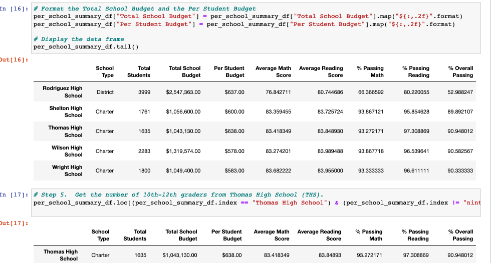
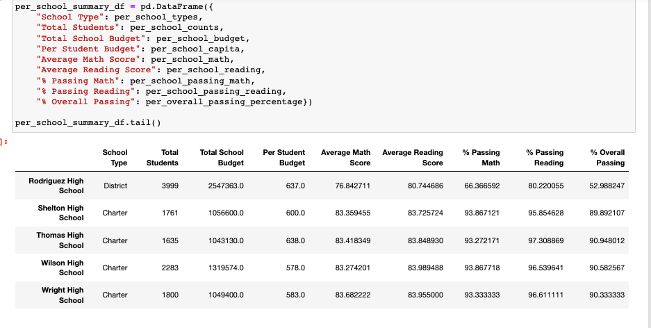
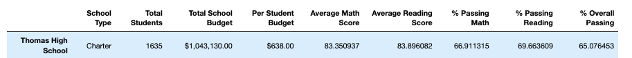
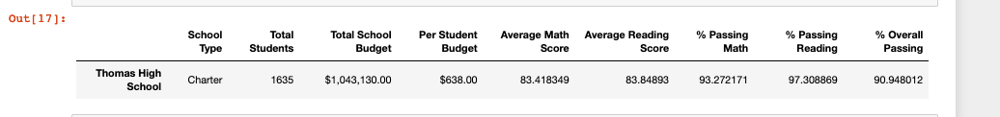

## School-District-Analysis
module 4 Pandas &amp; Jupyter Notebook

#Overview: Purpose
The purpose of this analysis was to gain experience in using the PANDAS library with multiple datasets. Within Python, we extract raw data from multiple sources, clean, transform, manipulate, analyze, perform mathematical calculations, and visualize data while leaving the original dataset intact. PANDAS library is an open-source library that provides us with high performance data analysis tools. In Jupyter notebook, we are able to perform all these commands with the end result of having a clear visulaization of the data with charts and graphs. 
With the given data in pycityschools, we are expected to analyze the data without ninth graders at Thomas High School so that the school can determine whether or not there is academic dishonesty affecting the grades.

#Results
How is the District Summary affected:

How is the School Summmary affected:

How does replacing the ninth graders' math and reading scores affect Thomas High School's performance relative to the other schools?

#How does replacing 9th grade scores affect the following:

#math and reading scores by grade

#Scores by school spending

#Scores by school size

#Scores by school type

#Summary

Four major changes in the updated school district analysis after reading and math scores for the ninth grade at Thomas High school have been replaces with NaNs.

