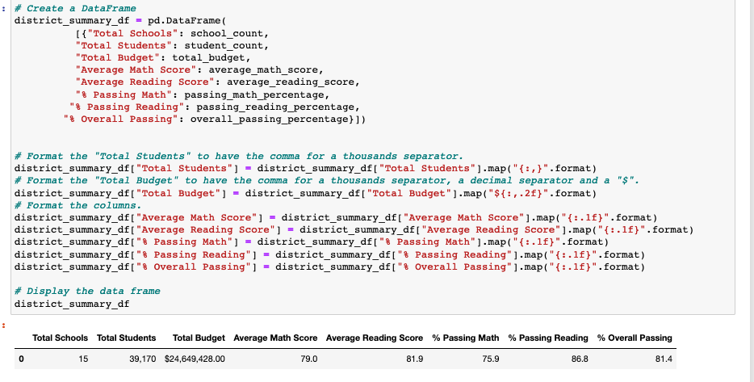

### School-District-Analysis
module 4 Pandas &amp; Jupyter Notebook

**Overview: Purpose**
The purpose of this analysis was to gain experience in using the PANDAS library with multiple datasets. Within Python, we extract raw data from multiple sources, clean, transform, manipulate, analyze, perform mathematical calculations, and visualize data while leaving the original dataset intact. PANDAS library is an open-source library that provides us with high performance data analysis tools. In Jupyter notebook, we are able to perform all these commands with the end result of having a clear visulaization of the data with charts and graphs. 
With the given data in pycityschools, we are expected to analyze the data without ninth graders at Thomas High School so that the school can determine whether or not there is academic dishonesty affecting the grades.

**Results**
How is the District Summary affected:

How is the School Summmary affected:

How does replacing the ninth graders' math and reading scores affect Thomas High School's performance relative to the other schools?

**How does replacing 9th grade scores affect the following:**

**math and reading scores by grade**

**Scores by school spending**

**Scores by school size**

**Scores by school type**

**Summary**

According to our data, there have been some major changes when we compare the school district analyses before and after the ninth grade Thomas High School students' grades have been replaced with NaNs. Previously, Thomas High School showed an average math score of 83.35, average reading score of 83.89, % passsing math at 66.91, % passing reading at 69.66, and an overall passing % of 65.07. Afterwards, we see very different numbers with Thomas High School with an average math score at 83.41, reading score at 83.85, % passing math at 93.27, % passing reading 97.30, and overall 90.95%.
When we bin our schools, we find that the schools who spend more money do not necessarily have higher scores or passing rates for their students. However, school size and type do show a correlation. Small and medium size schools have very similar student passing rates while schools with more students average a lot lower in scores. Lastly, charter schools have a much higher passing percentage than district schools.

